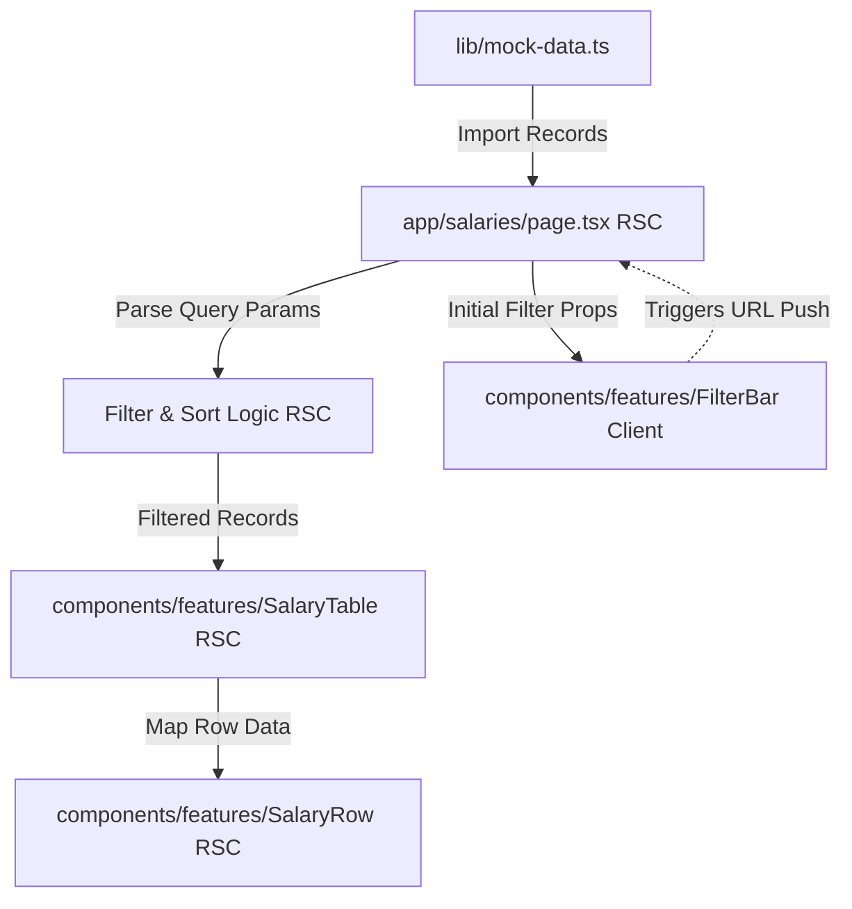

# Architecture Documentation: React Server Components & Data Flow

This document details the React Server Component (RSC) architecture, component hierarchy, boundary rules, and data flow used in TalentDash.

## 1. Component Hierarchy

The following ASCII diagram illustrates the component hierarchy and the React Server Component (RSC) boundaries across the application:

```
                                +-------------------+
                                |    RootLayout     |
                                |       (RSC)       |
                                +---------+---------+
                                          |
                     +--------------------+--------------------+
                     |                                         |
            +--------+--------+                       +--------+--------+
            |  SalariesPage   |                       |   CompanyPage   |
            |      (RSC)      |                       |      (RSC)      |
            +--------+--------+                       +--------+--------+
                     |                                         |
           +---------+---------+                     +---------+---------+
           |                   |                     |                   |
  +--------+--------+ +--------+--------+   +--------+--------+ +--------+--------+
  |    FilterBar    | |  SalaryTable    |   |  CompanyHeader  | |  CompanyStats   |
  |  ('use client') | |      (RSC)      |   |      (RSC)      | |      (RSC)      |
  +-----------------+ +--------+--------+   +-----------------+ +-----------------+
                               |                                         |
                      +--------+--------+                       +--------+--------+
                      |    SalaryRow    |                       |LDistributionBar |
                      |      (RSC)      |                       |      (RSC)      |
                      +--------+--------+                       +-----------------+
                               |
                      +--------+--------+
                      |   LevelBadge    |
                      |      (RSC)      |
                      +-----------------+
```

---

## 2. Component Classifications

### React Server Components (RSC)

RSCs render entirely on the server and send pre-rendered HTML to the client, requiring zero client-side JavaScript bundle size and eliminating hydration costs for those components.

| Component / File       | Directory                                      | Why it is a Server Component (RSC)                                                                              |
| ---------------------- | ---------------------------------------------- | --------------------------------------------------------------------------------------------------------------- |
| `RootLayout`           | `app/layout.tsx`                               | Defines the global wrapper and HTML shell. No interactive state required.                                       |
| `Home`                 | `app/page.tsx`                                 | Purely performs a server-side redirect (`redirect('/salaries')`).                                               |
| `NotFound`             | `app/not-found.tsx`                            | Static fallback for 404 pages. No client-side behavior.                                                         |
| `SalariesPage`         | `app/(routes)/salaries/page.tsx`               | Fetches, parses filters, and coordinates table rendering. Server-side processing keeps the payload lightweight. |
| `CompanyPage`          | `app/(routes)/companies/[slug]/page.tsx`       | Fetches static data, pre-renders organization stats, sitemaps, and distributions.                               |
| `CompareLayout`        | `app/(routes)/compare/layout.tsx`              | Static SEO layout container.                                                                                    |
| `CompanyHeader`        | `components/features/CompanyHeader.tsx`        | Pure display component containing links.                                                                        |
| `CompanyStats`         | `components/features/CompanyStats.tsx`         | Pure rendering of stats values and ranges.                                                                      |
| `LevelDistributionBar` | `components/features/LevelDistributionBar.tsx` | Renders visual distribution segments as pre-styled HTML elements.                                               |
| `SalaryTable`          | `components/features/SalaryTable.tsx`          | Static tabular grid using native `<a>` anchors for sorting via query string parameters.                         |
| `SalaryRow`            | `components/features/SalaryRow.tsx`            | Individual table row content formatter.                                                                         |
| `ConfidenceDot`        | `components/ui/ConfidenceDot.tsx`              | Pure styling indicator based on confidence score.                                                               |
| `EmptyState`           | `components/ui/EmptyState.tsx`                 | Static messaging and reset link.                                                                                |
| `LevelBadge`           | `components/ui/LevelBadge.tsx`                 | Pure display badge colored using static CSS classes.                                                            |
| `Pagination`           | `components/ui/Pagination.tsx`                 | Renders native link-based navigation buttons mapped to page query params.                                       |
| `SourceBadge`          | `components/ui/SourceBadge.tsx`                | Simple visualization badge for record sources.                                                                  |

---

### Client Components (`'use client'`)

Client Components are hydrated on the client side and are utilized only when client-side interactivity, state management, or browser APIs are required.

| Component / File  | Directory                                 | Specific Justification for `'use client'`                                                                                                                              |
| ----------------- | ----------------------------------------- | ---------------------------------------------------------------------------------------------------------------------------------------------------------------------- |
| `ComparePage`     | `app/(routes)/compare/page.tsx`           | Interactive page requiring real-time updates of selection states, dominant currency detection, search parameters lookup, and programmatic `router.replace` navigation. |
| `FilterBar`       | `components/features/FilterBar.tsx`       | Implements user typing/search debouncing (`useState`, `useEffect`), dropdown state changes, standard checkboxes, and client-side URL updates.                          |
| `ComparisonTable` | `components/features/ComparisonTable.tsx` | Interactive table displaying comparisons, currency conversion toggles, diff styling, and winner designations that react immediately to client-side selections.         |
| `CompanyLogo`     | `components/ui/CompanyLogo.tsx`           | Implements interactive image `onError` fallback handling state.                                                                                                        |

---

## 3. RSC Boundary & Serialization Rules

Next.js App Router defines clear boundaries between Server and Client Components:

1. **Server to Client Parent-Child Rendering:** Server Components can import and render Client Components directly (e.g., `SalariesPage` renders `FilterBar`).
2. **Client to Server Children Injection:** Client Components cannot directly import Server Components. To render a Server Component inside a Client Component, the Server Component must be passed as `children` or another prop from a Server Component parent, preventing the Server Component from being pulled into the client bundle.
3. **Data Serialization:** When passing data across the RSC boundary (from Server to Client Components), props must be fully serializable (i.e. plain JSON objects, strings, arrays, booleans, and numbers). Complex types (such as functions, classes, or database connections) cannot cross the boundary.
4. **Hydration Prevention:** Server-only sub-trees (like `SalaryTable` inside `SalariesPage`) are pre-rendered to HTML. They bypass the client hydration process entirely, resulting in zero client-side JavaScript execution for the table layout, rows, and cells.

---

## 4. Data Flow Architecture

The data flow is engineered to maximize server-side computation and minimize client-side rendering costs:



### Detailed Sequence

1. **Server Fetch & Filter:** `app/salaries/page.tsx` runs on the server. It imports all salary records directly from `mock-data.ts` and parses the request's query string using `parseSearchParams`.
2. **Server Processing:** The page filters and sorts the records on the server via `filterAndSortRecords`.
3. **HTML Generation:**
   - The computed page size, current page slice, and sorted list are passed to `SalaryTable`.
   - `SalaryTable` maps over the records, spawning `SalaryRow` components.
   - Everything renders into static HTML. No JavaScript is shipped to hydrate the table, cells, badges, or rows on the client.
4. **Client Interactivity Bridge:**
   - The `FilterBar` is loaded as a client component and rendered alongside the table.
   - When the user types a company name or changes a selector in the `FilterBar`, it triggers `router.push('/salaries?...')`.
   - Next.js fetches the new page data, runs the Server Component logic again, and patch-updates the DOM, preserving the server-centric data flow.

---

## 5. Performance & Optimization Targets

Performance targets: LCP < 2s on 4G mobile, CLS < 0.1, no render-blocking resources.
